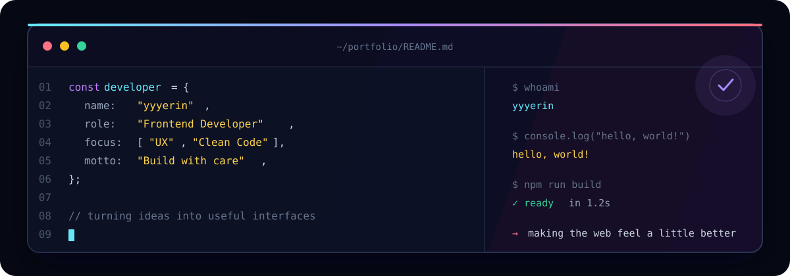

<div align="center">



<br />
<br />

# 안녕하세요, 프론트엔드 개발자 yyyerin입니다 👋

사용자의 관점에서 생각하고, 오래 쓰고 싶은 서비스를 만드는 개발자입니다.

[](https://portfolio.yyyerin.co.kr)
[](https://github.com/hyr0208)
[](mailto:hhyr0208@gmail.com)

</div>

<br />

## About me

```ts
const yyyerin = {
  role: "Frontend Developer",
  values: ["User Experience", "Ownership", "Continuous Improvement"],
  goal: "사용하기 좋은 서비스를 꾸준히 만들어 갑니다.",
};
```

- 사용자 흐름을 고민하고, 직관적인 인터페이스를 구현합니다.
- 맡은 일은 끝까지 책임지고, 더 나은 방법을 계속 탐색합니다.
- 기획부터 배포까지 제품의 전체 흐름을 이해하며 개발합니다.

## Tech stack

### Frontend


### Collaboration & DevOps


## Selected projects

| Project | Description |
| :--- | :--- |
| [**Portfolio**](https://portfolio.yyyerin.co.kr) | React, TypeScript, Tailwind CSS로 제작한 개인 포트폴리오 |
| [**RiderLink**](https://riderlink.co.kr) | 반응형 웹 디자인과 SEO를 고려한 랜딩페이지 |
| [**AllCert**](https://allcert.yyyerin.co.kr) | 자격증 검색·필터링과 공식 사이트 연결을 제공하는 자격증 포털 |
| [**지원나우**](https://jiwonnow.yyyerin.co.kr) | 지역·업종 기반 정부지원사업 추천 웹 애플리케이션 |
| [**LunchPing**](https://lunchping.yyyerin.co.kr) | 위치 기반 맛집 추천 및 점심 메뉴 결정 도우미 |
| [**bomPick**](https://bompick.yyyerin.co.kr) | 구독 중인 OTT를 기반으로 콘텐츠를 추천하는 서비스 |
| [**Lotto**](https://lotto.yyyerin.co.kr/) | Firebase Realtime Database 기반 실시간 멀티플레이어 커피 내기 게임 |

<details>
<summary>프로젝트에서 다룬 주요 기능 보기</summary>

<br />

- 반응형 웹 디자인 및 모바일 최적화
- 검색, 카테고리·상태별 필터링, 상세 정보 조회
- Firebase Auth 기반 Google 소셜 로그인
- 위치 기반 맛집 추천 및 Kakao Maps API 연동
- Firebase Realtime Database 기반 실시간 멀티플레이어
- Jenkins·Docker 기반 CI/CD

</details>

## GitHub activity

<div align="center">


</div>

## Contact

| Channel | Link |
| :--- | :--- |
| Email | [hhyr0208@gmail.com](mailto:hhyr0208@gmail.com) |
| Portfolio | [portfolio.yyyerin.co.kr](https://portfolio.yyyerin.co.kr) |
| GitHub | [@hyr0208](https://github.com/hyr0208) |

<br />

<div align="center">

꾸준히 배우고, 책임감 있게 만들겠습니다.


</div>
